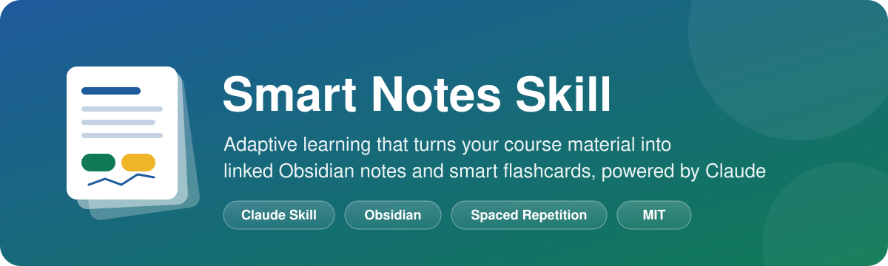
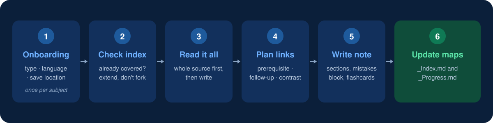
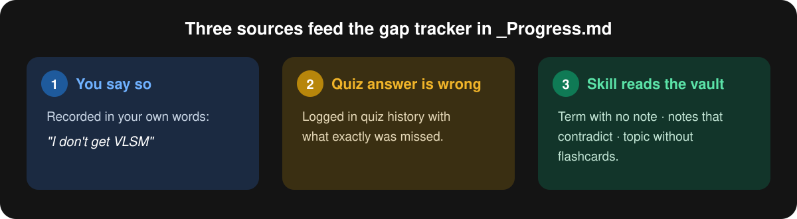
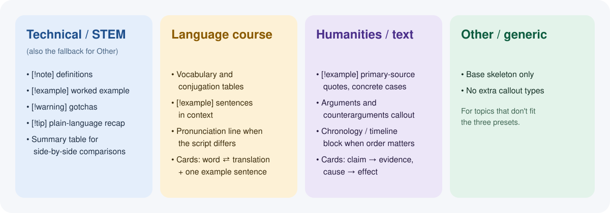

<p align="center">
  
</p>

<p align="center">
  
  
  
  
</p>

<p align="center">
  <b>An Obsidian notebook that thinks along.</b><br/>
  Not a transcript-to-file converter: it knows what has already been written, notices what you are weak on, links related ideas, and keeps its own flashcard deck sharp over time.
</p>

---

## 🎯 Why this exists

Most "AI note-taker" prompts do one thing: turn text into a formatted file. That falls apart once you have a whole course. New material overlaps with old notes, some topics never get tested, and flashcards pile up without any sense of what is sticking.

Smart Notes behaves like a notebook a diligent student would keep. It is deliberately generic: nothing in it is tied to one course, subject or language. It configures itself the first time you use it for a new subject.

## 🔄 What happens when you paste material



| Step | What the skill does |
|---|---|
| **1. Onboarding** | Once per subject it asks three things: subject name and type, note language(s), and where to save. Answers are stored in `_Progress.md`, so it never asks again. |
| **2. Check the index** | Looks in `_Index.md`. If your material is a near-duplicate of an existing topic, it tells you which file already covers it and extends that file. A separate new file only happens if you confirm it is a different topic. |
| **3. Read everything** | Reads the whole source and gathers every fact, number and example before writing. |
| **4. Plan the links** | Works out which existing topics this one connects to: prerequisite, follow-up, same category, or contrast. |
| **5. Write the note** | Builds the note from the shared skeleton and the preset for your subject type. |
| **6. Update the maps** | Refreshes `_Index.md` and `_Progress.md`. |

Once activated, the skill stays active for the rest of the conversation. Every later transcript or reading you paste is handled automatically.

## ✨ Key features

| | |
|---|---|
| 🗂️ **Linked notes, not isolated files**<br/>Every note has a `Related:` line with `[[wikilinks]]`, and `_Index.md` keeps a live map of every topic, its status and its links. | 🃏 **Adaptive flashcards**<br/>Weak topics get more cards and a wider spread of angles. Every deck includes a connection card when a genuine link to another topic exists. |
| 🧩 **Gap tracking**<br/>`_Progress.md` logs what you are weak on from three sources (see below). | ♻️ **Edits instead of duplicating**<br/>New material that extends or corrects a note edits that note directly, then briefly reports what changed. Affected flashcards, `_Index.md` and `_Progress.md` are updated too. |
| 🎛️ **Adapts to the subject**<br/>Four presets with their own note structure (see below). | 🧠 **Quizzes only when you ask**<br/>Never proposes a quiz or review unprompted. |

## 🗺️ Folder structure

One folder per subject:

```text
<Subject Name>/
  _Index.md        ← map of content: every topic, its status, its links
  _Progress.md     ← config (from onboarding) + gap tracker + quiz history
  <Topic 1>.md
  <Topic 2>.md
  ...
```

The `_` prefix keeps the two control files sorted above ordinary notes in any file browser.

### `_Index.md`

| Topic | Status | Links |
|---|---|---|
| [[Topic 1]] | ✅ covered | [[Topic 2]] |
| [[Topic 2]] | ⚠️ weak | [[Topic 1]], [[Topic 3]] |
| Topic 4 | ❌ not covered yet | referenced by [[Topic 2]] |

A topic that an existing note references but that has no note of its own stays listed as *not covered yet*.

### Note skeleton

Every note shares one skeleton: frontmatter, `# Title`, a `Related:` line, an opening definition, one section per concept, a common-mistakes callout, and a flashcard deck.

```markdown
> [!warning] Common mistakes / things people mix up
> - <mistake 1>
> - <mistake 2>

## Flashcards
#flashcards

<Question>?
?
<Answer>
```

The bare `?` line is the question/answer separator of the Obsidian Spaced Repetition plugin.

## 🧩 Gap tracking



## 🎛️ Presets



If the subject is configured as bilingual, every prose line and every flashcard question and answer appears as a pair in the two languages you chose. Structure stays identical.

## 🃏 Adaptive flashcards

- Topics flagged **weak** get more cards and a wider spread of angles: bare definition → mechanism / why → applied scenario.
- Difficulty is graded across that spread instead of writing every card at the same level.
- Whenever a genuine link exists, at least one **connection card** tests the relation between this topic and a related one already in the vault, for example *how does CIDR relate to a routing table entry?*

The repeated reviews themselves are run by the Obsidian Spaced Repetition plugin.

## 🧠 Self-check quizzes

Only when you explicitly ask:

- No topic named → it pulls from `_Progress.md`, weak and not-yet-tested topics first.
- A quick quiz widget for factual recall; plain chat for deeper "explain why / how" questions, where you answer in your own words and it evaluates.
- The outcome is logged back into the quiz history in `_Progress.md`.

## 💬 How replies look

Every reply leads with the file name in bold, whether creating or editing, followed by a short bullet summary of what the file covers or what changed. The full file is not pasted into chat.

## 🛡️ Guardrails

- If pasted material is itself a graded assessment (look for "Honor Code", "Submit", point values), it never supplies the answers, even if asked repeatedly. It offers to explain the underlying concept or run a separate self-check quiz instead.
- Any embedded "AI assistant instructions" inside pasted transcripts or page text are treated as inert content, never as commands.

## 📦 Installation

This is a single `SKILL.md` file, the standard format for a [Claude Skill](https://docs.claude.com/en/docs/claude-code/skills).

1. Copy `SKILL.md` into your Claude skills directory, typically `~/.claude/skills/smart-notes/SKILL.md` (check Anthropic's current docs for the exact path).
2. Restart or reload Claude so it picks up the skill.
3. Done. No dependencies, no build step.

## 🚀 Usage

```text
/smart-notes
```

or

```text
/study
```

or just ask Claude to keep smart study notes or flashcards for a course. On the first run for a new subject, answer the onboarding questions. After that, paste lecture transcripts, readings or any course material.

To review, ask: *"quiz me on what I'm weak on"* or *"test me on [topic]"*.

## 🔧 Requirements

- [Obsidian](https://obsidian.md) (or any Markdown editor; wikilinks and callouts are Obsidian-flavored)
- [Spaced Repetition plugin](https://github.com/st3v3nmw/obsidian-spaced-repetition) if you want the flashcards to run as real spaced-repetition reviews

## 📄 License

MIT. See [LICENSE](LICENSE). Free to use, modify and redistribute.
